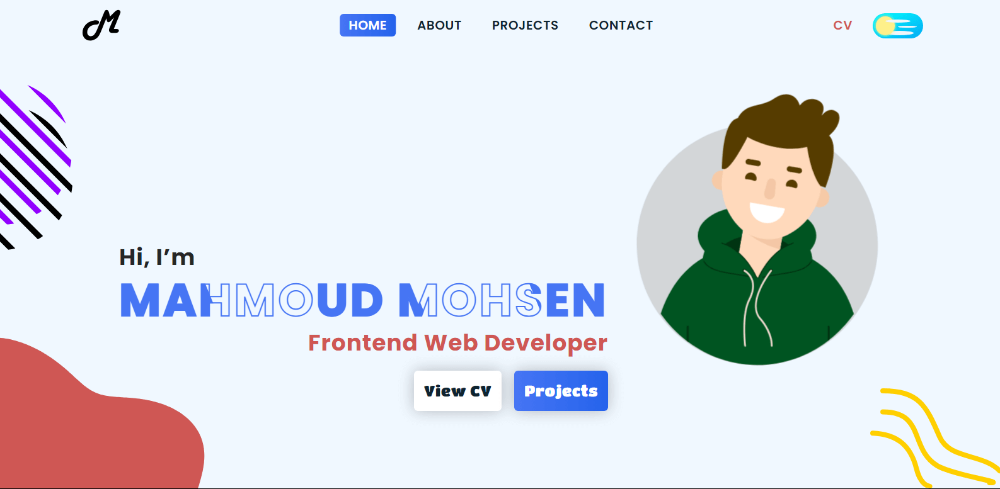

# My Portfolio

</img>

## Try it Live!

Check out the live app [mahmoud-mohsen-portfolio]()

## Features

- **Animated Avatar:** Dynamic avatar animation on every page reload.

- **Dark and Light Modes:** Switch between dark and light themes for a personalized reading experience.

- **Animated Hero Section:** Simple animation for the name title in the hero section.

- **Responsive Design:** Ensures a visually appealing and functional experience across various devices.

- **Contact Form:** Easily send messages directly to my email through the implemented contact form.

- **Route Navigation:** Effortless movement between different sections or pages.

## Challenges

Design complexity and aesthetics.

**How i tackled this challenge**

1. Used figma to preview the look of my portfolio before building it.
2. Gathered feedback from peers.
3. Started building the portfolio.

## Tools and libraries Used

- TypeScript
- TailwindCSS
- React
- Figma
- vite
- emailjs
- framer-motion
- lottie-react
- tw-elements-react
- lottie-react

## Getting Started

1. Clone this repository.

   ```bash
   git clone https://github.com/mahmoud-mohsen-dev/My-Portfolio.git
   ```

2. Navigate to the Project Directory:
   ```bash
   cd My-Portfolio
   ```
3. Install Dependencies:

   ```bash
    npm install
   ```

4. Start the Development Server:

   ```bash
   npm run dev
   ```

5. Open in your Browser:

   Open your web browser and go to http://localhost:3000 to see the app in action.

_Now, Mahmoud Mohsen's portfolio is up and running on your local machine._
